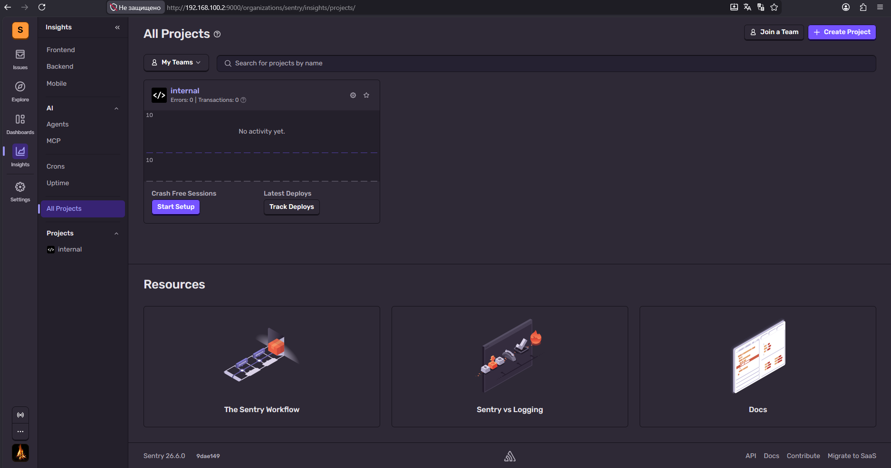
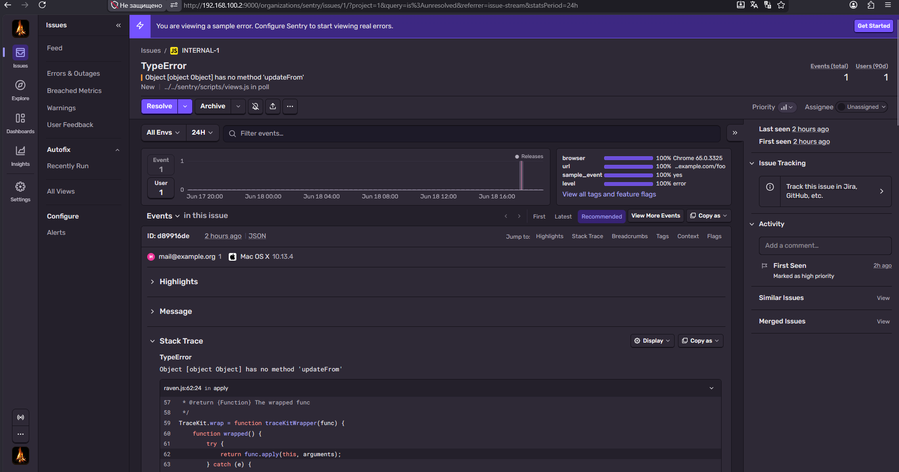
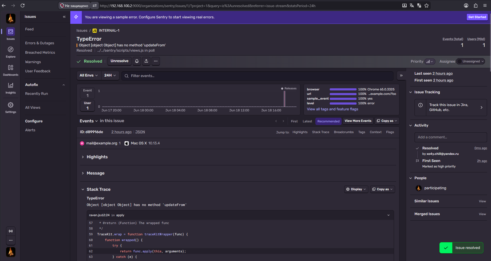
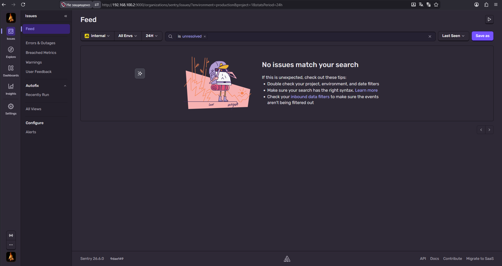
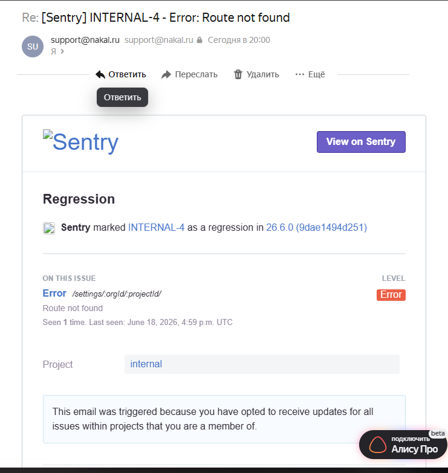
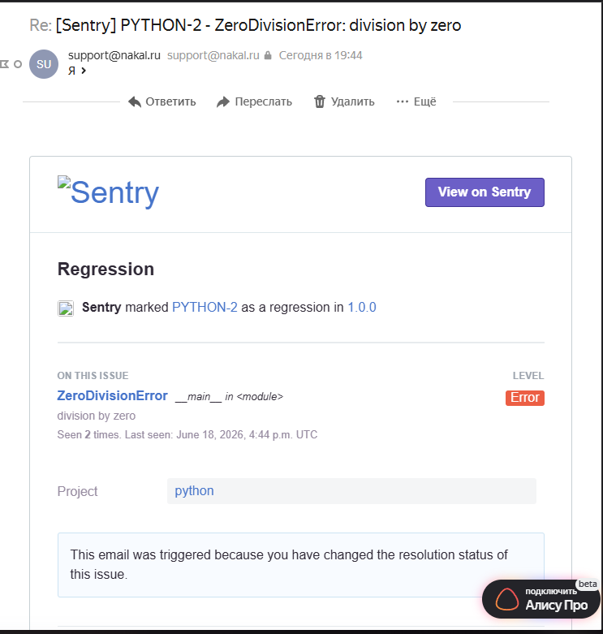

# Домашнее задание к занятию 16 «Платформа мониторинга Sentry»

---
## Задание 1. Меню Projects
Из за отсутсвия доступа к [https://sentry.io](https://sentry.io) нет возможности создать ```Free Сloud account```

Развернут Self-Hosted Sentry по инструкции из официального репозитория [`getsentry/self-hosted`](https://github.com/getsentry/self-hosted):

   ```bash
   git clone https://github.com/getsentry/self-hosted.git
   cd self-hosted
   ./install.sh
   docker compose up -d
   ```

**Скриншот Меню Projects**


---

## Задание 2. Тестовое событие, Stack Trace, Resolve
Не нашел где в ```self-hosted``` версии можно сгенерировать пример события для нового проекта на Python ,был использован встроенный проект на `JS`

**1. Скриншот Stack trace:**



**2. Скриншот списка событий (Issues) после нажатия `Resolved`:**




---

## Задание 3. Правила алёртинга и уведомление на почту

**Настройка исходящей почты в Self-Hosted Sentry**

Перед созданием алёрта , добавляем параметры SMTP в файле `sentry/config.yml`:

```yaml
mail.backend: 'smtp'
mail.host: 'smtp.gmail.com'       # или любой другой SMTP-сервер
mail.port: 25
mail.username: 'your@gmail.com'
mail.password: 'your_app_password'
mail.from: 'your@gmail.com'
```

После изменений перезапуск контейнеров:

```bash
docker compose down
docker compose up -d
```

**Скриншот тела сообщения из оповещения на почте**



